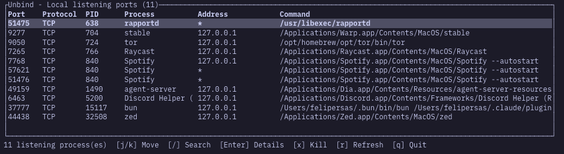

# Unbind

Find and free local ports from your terminal.



## Usage

```bash
unbind
unbind list
unbind list --json
unbind find 3000
unbind kill 3000
unbind kill 3000 --force
```

## Development

```bash
make
make check
make install
unbind
```

Common commands:

```bash
make run
make list
make json
make find PORT=3000
make kill PORT=3000
make release
```

## GitHub Releases

Create a tag to build and upload release assets:

```bash
git tag v0.1.0
git push origin v0.1.0
```

The release workflow builds Linux x86_64, macOS Apple Silicon, and macOS Intel tarballs with SHA256 checksum files.

`unbind` uses `lsof -iTCP -sTCP:LISTEN -n -P`, so the MVP supports Linux and macOS.

## TUI shortcuts

```txt
j / Down    move down
k / Up      move up
/           search
Enter       details
x           kill selected process
r           refresh
q / Esc     quit
```
